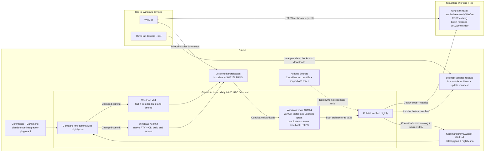

## Infrastructure



Cloudflare serves metadata only; binary downloads go directly to GitHub. Native
Windows gates precede publication to the production source and desktop update feed.
Deployment credentials stay in CI and are not bound to the Worker.

## Boundaries

A read-only Cloudflare Worker serves a bundled WinGet REST catalog on `workers.dev`.
GitHub Releases serve installer bytes. The Worker has no database, runtime GitHub
API dependency, upload endpoint, or runtime secrets; a catalog change is a Worker
deployment. This keeps metadata and code together and avoids eventually consistent
multi-key publication.

GitHub Actions is the only writer of generated package metadata and `nightly.sha`.
All targets build the same resolved fork commit and timestamped release identity.
The x64 job invokes the fork's composite build action. The ARM64 job invokes its
existing CLI version-stamping, web-build, compile, and smoke commands without
attempting an unsupported Electrobun ARM64 desktop build. No sibling checkout is
modified by this repository's development work.

The fork currently pins `bun-pty` 0.4.10, whose Windows DLL is x64-only. ARM64 CI
builds the DLL from that package's immutable source commit with its Cargo lockfile
and replaces only the dependency binary in the disposable checkout before compiling
the CLI. A dependency-version mismatch fails closed and requires reviewing the new
package rather than silently mixing native code versions. Native ARM64 smoke is a
release gate, not an assumed consequence of successful cross-compilation.
Dependency resolution is anchored to the absolute server workspace path using Bun's
resolver: resolving from the repository root can miss isolated workspace dependencies
or select a cached package rather than the installed one. A workspace-only fixture
checks the exact build-script expression to prevent that regression.

The source implements Microsoft's REST 1.4 contract, the first supporting portable
and nested ZIP installers. Desktop metadata preserves Electrobun's setup ZIP and
adjacent payload. Installation is interactive: Electrobun 2.0.1 has no silent-install
switch, and `--quiet` must never be passed to setup as an installation switch.

## Publication invariants

Installer URLs identify an immutable GitHub prerelease and SHA256 checksums cover
the published bytes. Both CLI architectures belong to one package identity; the
desktop is a separate x64-only package. Empty initial metadata advertises no fake
builds. Only the latest successfully adopted nightly is indexed; old releases remain
available on GitHub.

The Windows installation gate uses the candidate catalog before production
publication. A source build, checksum, manifest, or installation failure must not
advance the production catalog or source marker. Publication across GitHub and
Cloudflare is not transactional: once a release may have been adopted, cleanup must
retain its downloads rather than break installed catalogs. Desktop feed archives
are uploaded before the corresponding update manifest.

## Trust

These fork nightlies are unsigned. Checksums protect download integrity but do not
provide publisher signing or bypass Windows SmartScreen. Source addition is an
explicit trust decision. This distribution does not inherit JetBrains' private
signing pipeline. Runtime source endpoints never mutate data.

## Verification boundary

Protocol and publication helpers have local tests. Actual WinGet installation and
native CLI smoke checks belong on the corresponding Windows runners. A macOS
check cannot establish Windows installation success. Live deployment and the
first hosted nightly remain operator actions unless separately authorized.

## Deployment

The source endpoint is `https://winget-thinkrail.kotlin-releases-bot.workers.dev`.
The Cloudflare Worker is `winget-thinkrail`; its initial catalog is empty until
hosted Windows qualification succeeds.

1. Publish this repository as a public GitHub repository, normally
   `CommanderTvis/winget-thinkrail`, with default branch `main`. Public release
   downloads are required; hosted Windows ARM64 runners must be available to the
   repository. The code does not create a repository or configure a remote.
2. Select Cloudflare Workers Free and configure the account's `workers.dev`
   subdomain. Keep `workers_dev: true` in `wrangler.jsonc`; no personal domain,
   custom DNS, KV, R2, or database is needed.
3. With Bun 1.4.2 installed, bootstrap the empty source:

   ```sh
   bun install --frozen-lockfile
   bun run check
   bun run build
   bunx wrangler login
   bun run deploy
   ```

   Confirm the resulting HTTPS URL matches the source URL in `README.md` before
   announcing availability. `GET /information` must advertise
   REST `1.4.0`. An empty package search is expected until the first nightly.
   Authentication is for deployment only; WinGet clients need no token.
4. Create a Cloudflare API token with `Account / Workers Scripts / Edit`, scoped
   to the target account. Configure GitHub Actions repository secrets
   `CLOUDFLARE_API_TOKEN` and `CLOUDFLARE_ACCOUNT_ID`. Zone permissions are not
   needed. Keep credentials out of source files.
5. Allow the workflow's `GITHUB_TOKEN` to publish releases and push generated
   metadata to `main`. If branch protection requires pull requests or signed
   commits, arrange an approved automation path rather than bypassing those
   policies. No additional GitHub PAT is used.
6. Run **Actions → Nightly → Run workflow** on `main`. Both architecture builds
   and Windows installation jobs must pass before production publication. The
   initial empty deployment does not qualify Windows builds; the first hosted
   run does, including the native ARM64 terminal dependency. Subsequent runs also
   install the previous nightly and exercise WinGet upgrades.

The [Workers Free quota](https://developers.cloudflare.com/workers/platform/limits/)
currently allows 100,000 requests per day. Exhaustion makes metadata unavailable;
there is no paid fallback. Downloads bypass the Worker. GitHub Actions and release
hosting have separate limits.

## Operation and recovery

Nightlies run daily at 03:00 UTC or manually, skip unchanged fork commits by
comparing against `nightly.sha`, and use
`0.0.0-nightly.<UTC YYYYMMDDHHmmss>` versions. `nightly.sha` is absent until the first
successful adoption. Change `scripts/catalog.ts`, not generated catalog entries.

Publication order is immutable prerelease downloads, candidate installation gates,
Worker deployment, version-qualified desktop archive, desktop update manifest,
then the generated catalog/source-marker commit and push. The desktop feed lives
under the `desktop-updates` release. Its manifest changes only after the new archive
is available.

On build or installation failure, production stays unchanged and cleanup removes
the unadopted prerelease. After a partial publication failure, retain downloads,
fix the cause, and start a new workflow run. The unchanged source marker makes it
retry. Do not rerun only failed installation jobs after cleanup has removed their
candidate downloads.

For Worker-only fixes, deploy from up-to-date `main` containing the adopted catalog,
outside an active nightly run. An old or empty local catalog would remove advertised
packages. Keep old release downloads even though WinGet indexes only the latest
adopted nightly.

## Maintainer verification

```sh
bun install --frozen-lockfile
bun run check       # strict TypeScript, Biome, and unit tests
bun run build       # Cloudflare bundle dry-run, no deployment
bun run dev         # local Worker development
```

`Check` CI also runs actionlint and PowerShell parsing/PSScriptAnalyzer.
`scripts/test-install.ps1` is destructive and restricted to disposable hosted Windows
runners. Its localhost HTTPS source uses temporary trusted certificates, and the
framework's test-only installer autoclose variable avoids unattended dialogs.
Neither mechanism changes installation security on users' machines.

Protocol reference: [Microsoft WinGet REST 1.4](https://github.com/microsoft/winget-cli-restsource/blob/main/documentation/WinGet-1.4.0.yaml).
Hosting reference: [Cloudflare workers.dev](https://developers.cloudflare.com/workers/configuration/routing/workers-dev/).
