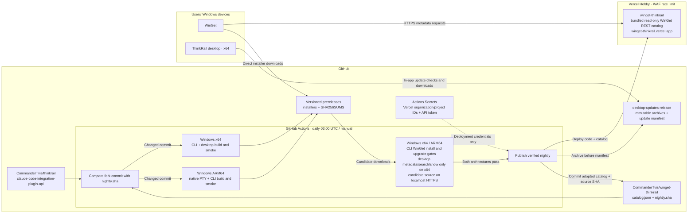

## Infrastructure

### Vercel migration acceptance criteria

The replacement host is Vercel Hobby with its provided `vercel.app` hostname.
A thin Node.js Function entry point uses the existing REST handler and bundled
adopted catalog; the persistent source identifier remains unchanged. GET and HEAD
at the root serve the generated static installation page with its security headers.
Other requests retain REST method, body-size, version, and query validation.

Before switching nightly publication, verify the deployed public hostname,
information, search, both package manifests, invalid requests, and static page.
Configure the project's WAF rate limiter to return 429 before function execution;
browser challenges must not gate WinGet. Keep qualification ahead of production
deployment and do not enable automatic Git production deployments that could
publish an unqualified catalog. Deployment credentials remain CI-only.

The legacy Cloudflare deployment remains available during migration; it is not
deleted automatically. Existing installations must remove and re-add their WinGet
source with the Vercel URL. Nightly publication switches when the workflow changes
reach main and its Vercel credentials are configured.
Accepted requests can still exhaust Vercel's free allowance; this migration does
not promise quota isolation across other Vercel projects.


```mermaid
flowchart LR
  subgraph GitHub["GitHub"]
    fork["CommanderTvis/thinkrail<br/>claude-code-integration-plugin-api"]
    repo["CommanderTvis/winget-thinkrail<br/>catalog.json + nightly.sha"]
    subgraph CI["GitHub Actions · daily 03:00 UTC / manual"]
      compare["Compare fork commit with nightly.sha"]
      x64["Windows x64<br/>CLI + desktop build and smoke"]
      arm64["Windows ARM64<br/>native PTY + CLI build and smoke"]
      gates["Windows x64 / ARM64<br/>CLI WinGet install and upgrade gates<br/>desktop metadata/search/show only on x64<br/>candidate source on localhost HTTPS"]
      publish["Publish verified nightly"]
    end
    releases["Versioned prereleases<br/>installers + SHA256SUMS"]
    feed["desktop-updates release<br/>immutable archives + update manifest"]
    secrets["Actions Secrets<br/>Vercel organization/project IDs + API token"]
  end

  subgraph Vercel["Vercel Hobby · WAF rate limit"]
    worker["winget-thinkrail<br/>bundled read-only WinGet REST catalog<br/>winget-thinkrail.vercel.app"]
  end

  subgraph Windows["Users' Windows devices"]
    winget["WinGet"]
    desktop["ThinkRail desktop · x64"]
  end

  fork --> compare
  repo --> compare
  compare -->|Changed commit| x64
  compare -->|Changed commit| arm64
  x64 --> releases
  arm64 --> releases
  releases -->|Candidate downloads| gates
  gates -->|Both architectures pass| publish
  secrets -.->|Deployment credentials only| publish
  publish -->|Deploy code + catalog| worker
  publish -->|Archive before manifest| feed
  publish -->|Commit adopted catalog + source SHA| repo
  winget -->|HTTPS metadata requests| worker
  winget -->|Direct installer downloads| releases
  desktop -->|In-app update checks and downloads| feed
```

Vercel serves metadata and the installation page; binary downloads go directly to GitHub. Native
Windows gates precede publication to the production source and desktop update feed.
Deployment credentials stay in CI and are not bound to the Function.

## Boundaries

The root path serves a responsive HTML installation guide with package availability
from the catalog. The build generates a static asset and bundles the REST handler
for Node.js. Vercel routes GET and HEAD at the root directly to the asset without
invoking the Function. Other requests route to the Function. Route headers retain
the page's content security policy and MIME sniffing protection.
It uses a single document column with browser-default typography, colors, and
spacing. Only long command and code wrapping uses CSS, so the page fits narrow
screens. It requires no JavaScript or external assets.

The REST endpoints remain dynamic: `/information` validates protocol headers,
manifest lookup filters version/channel query parameters, and search processes a
POST body. Unmatched requests fall through to the Function, preserving JSON
errors and method validation. The local Windows qualification server uses the
same page renderer and REST implementation.

A read-only Vercel Function serves a bundled WinGet REST catalog on `vercel.app`.
GitHub Releases serve installer bytes. The Function has no database, runtime GitHub
API dependency, upload endpoint, or runtime secrets; a catalog change is a Vercel
deployment. This keeps metadata and code together and avoids eventually consistent
multi-key publication.

GitHub Actions is the only writer of generated package metadata and `nightly.sha`.
All targets build the same resolved fork commit and timestamped release identity.
The x64 job invokes the fork's composite build action. The ARM64 job invokes its
existing CLI version-stamping, web-build, compile, and smoke commands without
attempting an unsupported Electrobun ARM64 desktop build. No sibling checkout is
modified by this repository's development work.

The fork currently pins `bun-pty` 0.4.10, whose Windows DLL is x64-only. ARM64 CI
builds the DLL from that package's immutable source commit with its Cargo lockfile
and replaces only the dependency binary in the disposable checkout before compiling
the CLI. A dependency-version mismatch fails closed and requires reviewing the new
package rather than silently mixing native code versions. Native ARM64 smoke is a
release gate, not an assumed consequence of successful cross-compilation.
Dependency resolution is anchored to the absolute server workspace path using Bun's
resolver: resolving from the repository root can miss isolated workspace dependencies
or select a cached package rather than the installed one. A workspace-only fixture
checks the exact build-script expression to prevent that regression.

The source implements Microsoft's REST 1.4 contract, the first supporting portable
and nested ZIP installers. Desktop metadata preserves Electrobun's setup ZIP and
adjacent payload. Installation is interactive: Electrobun 2.0.1 has no silent-install
switch, and `--quiet` must never be passed to setup as an installation switch.

## Publication invariants

Installer URLs identify an immutable GitHub prerelease and SHA256 checksums cover
the published bytes. Both CLI architectures belong to one package identity; the
desktop is a separate x64-only package. Empty initial metadata advertises no fake
builds. Only the latest successfully adopted nightly is indexed; old releases remain
available on GitHub.

Windows qualification uses the candidate catalog before production publication.
CLI WinGet installation and upgrade checks on x64 and ARM64 are hard gates, as are
the x64 desktop upstream composite build/native installer smoke and desktop WinGet
metadata/search/show validation on x64. Automated WinGet verification must not
launch desktop setup or attempt desktop installation or upgrade: unsigned setup
triggers SmartScreen requiring user interaction. Both packages still publish when
these gates pass; a manual desktop WinGet check remains unverified and non-blocking.
A source build, checksum, manifest, or required qualification failure must not
advance the production catalog or source marker. Publication across GitHub and
Vercel is not transactional: once a release may have been adopted, cleanup must
retain its downloads rather than break installed catalogs. Desktop feed archives
are uploaded before the corresponding update manifest.

## Trust

These fork nightlies are unsigned. Checksums protect download integrity but do not
provide publisher signing or bypass Windows SmartScreen. Source addition is an
explicit trust decision. This distribution does not inherit JetBrains' private
signing pipeline. Automation must not bypass Windows security or simulate clicking
“Run anyway”. Runtime source endpoints never mutate data.

## Verification boundary

Protocol and publication helpers have local tests. Actual CLI WinGet installation
and upgrade and native CLI smoke checks belong on the corresponding Windows runners.
Desktop qualification covers the x64 upstream composite build/native installer smoke
and WinGet metadata/search/show validation, not desktop WinGet installation or upgrade.
A macOS check cannot establish Windows installation success. Live deployment and the
first hosted nightly remain operator actions unless separately authorized.

## Deployment

The public source is `https://winget-thinkrail.vercel.app`. The project is
`winget-thinkrail` in the `commandertvis` Hobby team; no personal domain is needed.
Production is public so WinGet requires no Vercel authentication. Automatic Git
integration is not connected: only qualified catalogs may reach production.

1. Install dependencies with `bun install --frozen-lockfile`, then run
   `bun run check` and `bun run build`.
2. Authenticate with `bunx vercel@62.1.0 login` and link the existing project with
   `bunx vercel@62.1.0 link --yes --project winget-thinkrail`.
   Keep `.vercel/` and `.env*` local and ignored. Do not connect automatic Git
   deployments.
3. Deploy the adopted catalog with `bun run deploy`. Verify it using
   `bun scripts/verify-source.ts https://winget-thinkrail.vercel.app`.
   The Vercel Function imports a Bun-generated Node.js bundle, avoiding runtime
   TypeScript imports and extensionless module resolution.
4. Configure GitHub Actions secrets `VERCEL_ORG_ID`, `VERCEL_PROJECT_ID`, and
   `VERCEL_TOKEN`. Scope the API token to the owning team and, where supported,
   this project. Never store the token in source files. Nightly CI passes it
   explicitly to the CLI, deploys after qualification, then checks the public
   source before publishing the desktop feed and adopting metadata.
5. The project's active WAF rule limits all paths to 120 requests per IP per
   60-second fixed window and returns 429 when exceeded. Automatic DDoS
   mitigations are active; Attack Mode and browser bot challenges are off so
   WinGet remains usable. Review changes with `vercel firewall diff` and publish
   them with `vercel firewall publish`. NAT users share the per-IP allowance.
6. Run the hosted Nightly workflow after the changed workflow reaches main.
   Existing native CLI x64/ARM64 qualification and desktop x64 metadata/build
   gates remain mandatory. Desktop WinGet installation remains manual and
   unverified.

[WAF-mitigated traffic](https://vercel.com/docs/vercel-firewall/vercel-waf/usage-and-pricing)
does not consume CDN requests or fast data transfer. Accepted requests still
consume [Hobby allowances](https://vercel.com/docs/plans/hobby), and a distributed
attack can evade per-IP limits. This is mitigation, not guaranteed availability
or isolation from other projects on the same Vercel team. GitHub downloads do
not traverse the Function, and this endpoint no longer consumes the Cloudflare
account's Workers request quota.

The legacy Worker and its `wrangler.jsonc` remain available for migration recovery;
use `bunx wrangler deploy` explicitly if recovery requires republishing it. Its
existing URL remains `https://winget-thinkrail.commandertvis.workers.dev`; it does
not receive new catalogs after nightly publication switches to Vercel.

## Operation and recovery

### Traffic notifications

The free `Source traffic alert` workflow polls Vercel firewall counters every
15 minutes, using the existing project ID and token secrets. It fails when the
last 15 minutes contain at least 1,000 accepted requests or 100 blocked requests,
or when the last 24 hours contain at least 10,000 accepted requests. This catches
both bursts and sustained allowance consumption. Missing or invalid metrics and
failed API queries also fail the monitor rather than reporting a healthy result.

Enable GitHub Actions email notifications with failed runs only at
`https://github.com/settings/notifications`. Scheduled-run notifications go to
the user who last modified the cron schedule. The workflow becomes active only
after it reaches the default branch; verify notification delivery with a manual
run. It does not create issues or send Slack messages. Alerting can repeat while
the thresholds remain exceeded.

GitHub schedules and Vercel metrics can be delayed, so this is best-effort polling,
not a real-time notification guarantee or an automatic shutdown. It does not
measure CPU or transfer allowance. Vercel's separate built-in usage-anomaly
alerts require a paid plan; its standard quota notifications are independent.

Nightlies run daily at 03:00 UTC or manually, skip unchanged fork commits by
comparing against `nightly.sha`, and use
`0.0.0-nightly.<UTC YYYYMMDDHHmmss>` versions. `nightly.sha` is absent until the first
successful adoption. Change `scripts/catalog.ts`, not generated catalog entries.

Publication order is immutable prerelease downloads, candidate qualification gates,
Vercel deployment and public-source verification, version-qualified desktop archive, desktop update manifest,
then the generated catalog/source-marker commit and push. The desktop feed lives
under the `desktop-updates` release. Its manifest changes only after the new archive
is available.

On build or required qualification failure, production stays unchanged and cleanup removes
the unadopted prerelease. After a partial publication failure, retain downloads,
fix the cause, and start a new workflow run. The unchanged source marker makes it
retry. Do not rerun only failed installation jobs after cleanup has removed their
candidate downloads.

For source-only fixes, deploy from up-to-date `main` containing the adopted catalog,
outside an active nightly run. An old or empty local catalog would remove advertised
packages. Keep old release downloads even though WinGet indexes only the latest
adopted nightly.

## Maintainer verification

```sh
bun install --frozen-lockfile
bun run check       # strict TypeScript, Biome, and unit tests
bun run build       # static page + Node.js bundle, no deployment
bun run dev         # local Vercel development
```

`Check` CI also runs actionlint and PowerShell parsing/PSScriptAnalyzer.
`scripts/test-install.ps1` is destructive and restricted to disposable hosted Windows
runners. Its HTTPS source uses an IPv4 loopback URL and a temporarily trusted
certificate with the matching IP-address SAN, avoiding localhost IPv6 resolution
against an IPv4-only listener. Readiness failures retain their underlying exception;
certificate verification is never skipped. Automated desktop WinGet checks validate
metadata/search/show only and never launch setup. Desktop native installer smoke
remains the upstream composite build's hard gate; it does not establish desktop
WinGet installation or upgrade success.

When WinGet is unavailable, bootstrap pins the PowerShell module to `1.29.280` and
requests GitHub release tag `v1.29.290` for the current runner user. The repair module
passes the supplied tag verbatim when registering a provisioned package: omitting
`v` causes a GitHub 404. Unversioned repair can also infer a nonexistent release from
a provisioned Store package. PowerShell Gallery module versions and WinGet CLI release
versions are independent; verify that both pins exist in their respective registries.
All-users provisioning is unnecessary for these checks.

Protocol reference: [Microsoft WinGet REST 1.4](https://github.com/microsoft/winget-cli-restsource/blob/main/documentation/WinGet-1.4.0.yaml).
Hosting reference: [Vercel Node.js Functions](https://vercel.com/docs/functions/runtimes/node-js).
